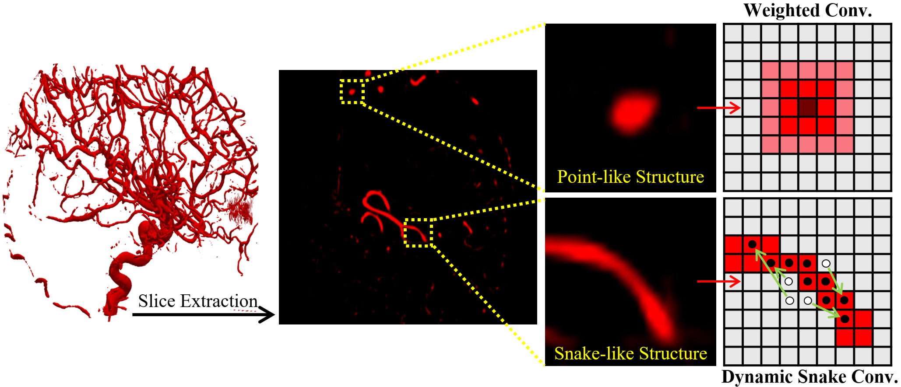
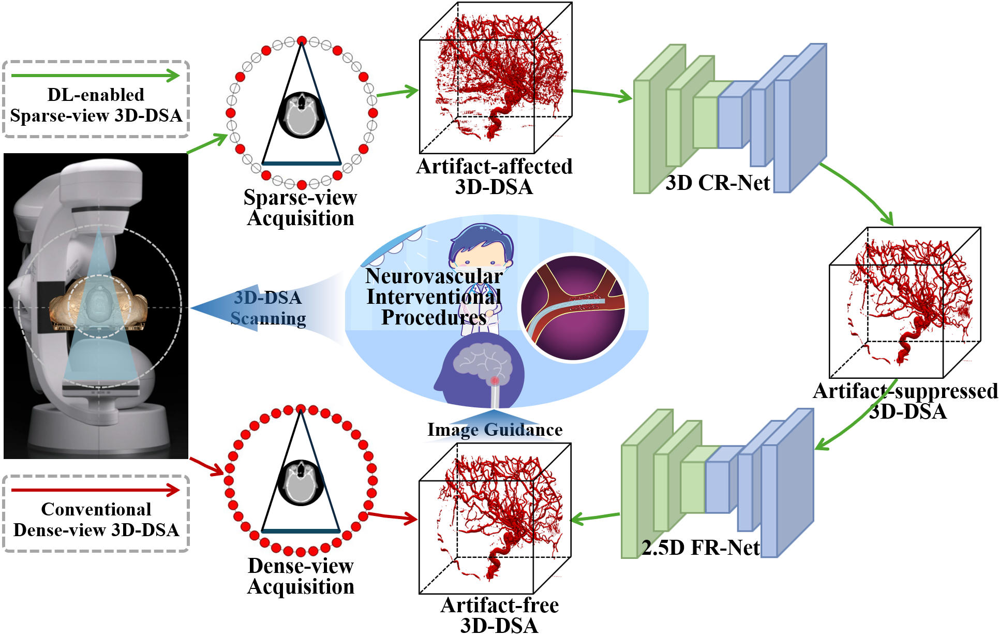
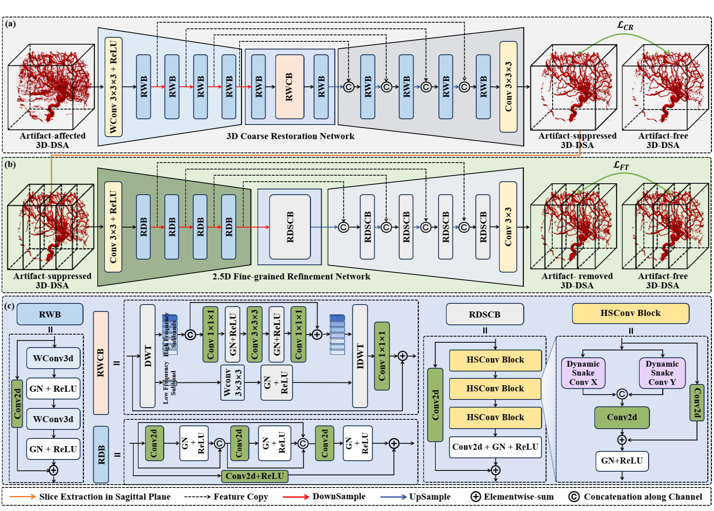

# Vascular Morphology Motivated Progressive Structure-Enhanced Restoration for Sparse-view 3D-DSA
Yikun Zhang, Changqiu Xu, Shiyu Zhu, et al.


## Abstract
> Three-dimensional digital subtraction angiography (3D-DSA) is a key technique for the diagnosis and treatment of cerebrovascular diseases. The conventional dense-view acquisition is time-consuming and delivers a considerable radiation dose to both patients and doctors, making sparse-view acquisition a highly promising solution. However, sparse sampling induces severe streak artifacts in 3D-DSA images, thereby affecting subsequent treatment procedures. To address these issues, this study presents a Progressive Structure-Enhanced Restoration (PSER) framework for sparse-view 3D-DSA. First, a 3D DNN is designed to inherently exploit inter-slice and intra-slice correlations for coarse artifact removal and image restoration. The Discrete Wavelet Transform and Weighted Convolution are integrated to encourage the 3D DNN to focus on the restoration of highfrequency vascular structures in the frequency domain and spatial domain, respectively. Second, a 2.5D DNN is employed to further restore fine-grained vascular details while avoiding discontinuities along the head-foot direction in 3D-DSA images. Considering that brain vessels exhibiting snake-like morphological characteristics, dynamic snake convolution is integrated to adaptively capture complex in-plane vascular tortuosity through topology-aware deformation, thereby improving vessel continuity in the axial plane. Qualitative and quantitative results on both a simulation dataset and a clinical dataset demonstrate the promising performance of the proposed PSER method in artifact removal, structure restoration and continuity preservation.

## Motivation
<p align="center">  </p>

## Workflow
<p align="center">  </p>

## Network Architecture
<p align="center">  </p>

## Visual Comparisons
<p align="center">  </p>


## Usage
### 1.Environment Setup
```bash
pip install -r requirements.txt
```
### 2. Model Training

```
cd code
```
To begin Stage I training:
```
python train_stage1.py 
```

To begin Stage II training:

```
python train_stage2.py
```

### 3. Model test

To begin Stage I testing:
```
python test_stage1.py 
```

To begin Stage II testing:
```
python test_stage2.py
```
## Dataset Structure
Please place your raw DICOM/NIfTI files in the ./Data/ folder. Then run 
```
python generate_data.py
```
and
```
python divide_data.py
```
The dataset directory of Stage I should be organized as follows:
```
./Data/
├── input/
    └── Patient_0001.nii   # Sparse-view image (Input)
        ...
└── label/
    └── Patient_0001.nii   # Dense-view image (Ground Truth)
        ...
└── splits.json
```

After running
```
python test_stage1.py 
```
we should run
```
python mk_2.5d_slice.py
```
to generate data for stage II. The dataset directory of Stage II should be organized as follows:

```
./Data/
├── input/
    └── Patient_0001.nii   # Sparse-view image (Input)
        ...
└── label/
    └── Patient_0001.nii   # Dense-view image (Ground Truth)
        ...
└── Stage1Results
    └── Patient_0001.npy
        ...
└── TrainSlice2D
    └── Patient_0001_slice0.npz
        Patient_0001_slice1.npz
        Patient_0001_slice2.npz
        ...
└── ValidSlice2D
    └──Patient_0001_slice0.npz
       Patient_0001_slice1.npz
       Patient_0001_slice2.npz
       ...
│  
└── splits.json
```
## Notes
Code and model configurations are tested under Python 3.10+, PyTorch 2.0.0

## Acknowledgment


This repository is the official implementation of the paper: "Progressive Structure-Enhanced Restoration Framework for Sparse-View 3D-DSA Reconstruction", featuring optimized code structure, comprehensive documentation, and enhanced model reproducibility.

